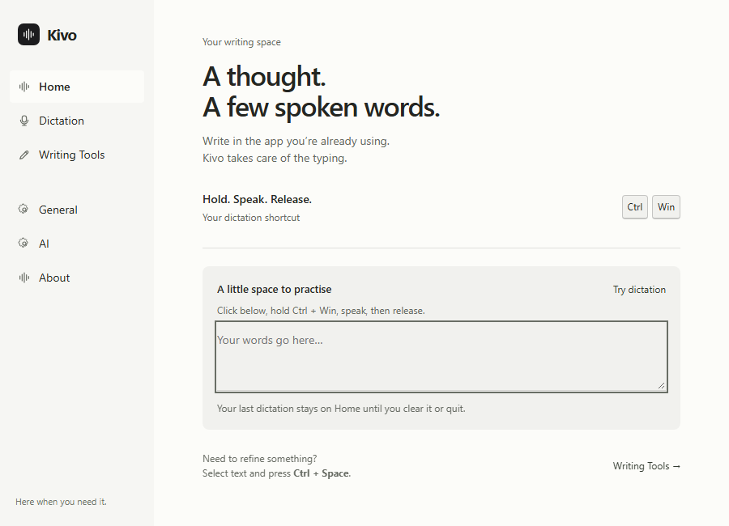
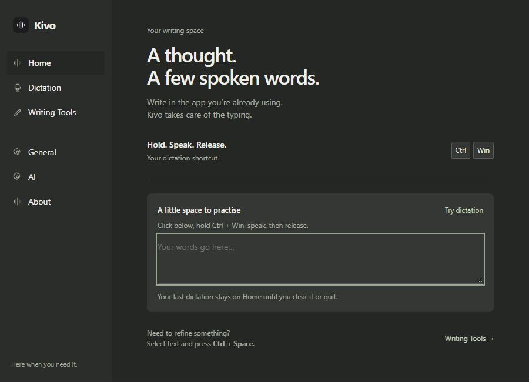

# Kivo overhaul: implementation and release status

12-13 September 2026. Changes are local and have not been published.

## TL;DR

- The new app UI is implemented: Home, dictation practice, session recovery, quieter settings, a simpler Writing Tools menu, and temporary recording feedback.
- Keep Tauri. Windows uses real window controls, neutral DWM frames, system fonts, tray state, and monitor work areas. The delivery format remains a per-user `.exe`.
- Reliability changes protect the original text target, support cancellation throughout dictation, and preserve results when insertion fails.
- macOS keeps its native speech and Accessibility integrations, receives the shared redesign, and gains safer speech startup/shutdown handling.
- Local checks pass. This is a candidate for native testing, not a claim that the complete installed-app matrix or macOS build has passed.

## Implemented

| Area | Change and reason |
|---|---|
| Home | Actual configured shortcuts, an editable practice field, and the last completed dictation. No invented usage statistics or unverified green readiness badge. |
| Visual system | Warm white, graphite, restrained green, platform typography, larger text, flatter preferences, light/dark themes, reduced motion and forced-colour handling. Native title bars remain. |
| Writing Tools | Proofread, Rewrite and Shorten lead. More actions keeps tone and informational actions reachable by mouse and keyboard. Existing summaries and custom instructions remain. |
| Dictation | Starting, Listening and Finishing are distinct. Windows shows a recording label instead of a fabricated waveform. The indicator has Finish and dismissible error controls. Idle remains hidden by default. |
| Text delivery | Capture before activating the popup. Validate the original control and caret/selection; reject changed targets. Failed rewrites become copyable results. Failed dictation insertion leaves text on Home. |
| Clipboard | Removed simulated Copy/Paste fallbacks that could overwrite unrelated clipboard formats or insert into the wrong field. Only an explicit Copy action changes the clipboard. Direct AX/UIA support varies between applications. |
| Cancellation | A single dictation operation and generation protect startup, recognition, AI cleanup and delivery. Late callbacks/timers cannot finish a cancelled session. Tests use delayed speech and local HTTP fixtures. |
| Settings | Synchronize settings events across surfaces; restore runtime preferences when persistence fails; use replacing rename on Windows instead of deleting the old file first. |
| Windows shell | Suppress accent frames, remove the rectangular transient backdrop, use taskbar-aware placement, bound initial main-window size to the work area, follow caption theme, and update tray Pause/Resume labels. |
| Windows speech | Desktop SAPI on a COM worker replaces the package-identity-dependent WinRT route. Enumerate installed desktop engines. This preserves the `.exe` distribution route; it does not promise Wispr's recognition quality or language coverage. Uses the default microphone. |
| macOS speech | Wait for actual microphone startup, retain native sessions through final results, prevent callbacks into freed Rust storage, and serialize audio start/stop. Native SpeechAnalyzer remains. Removed an incorrect vertical flip from Quartz cursor coordinates and scaled AX bounds; mixed-DPI Mac placement remains a native validation item. |
| Distribution | Per-user NSIS `.exe`, Windows 11 24H2 minimum, optional Authenticode signing. Stable macOS signing/notarization and updater metadata remain. Windows checks stable releases without offering a beta to an up-to-date stable installation. |
| CI/docs | Windows frontend checks gate the beta; the PR build label triggers CI; stable releases run native tests/clippy and packaging checks. Website/README installation copy matches the `.exe` route. |

The latest completed dictation is held only in application memory until replaced, cleared, or Kivo quits. Cancelled dictations are discarded. It is not a persistent history feature.

## Preview

These are screenshots of the implemented React surfaces in the Windows browser harness, not native desktop screenshots. Keyboard focus is intentionally visible in the practice field. Mac frontend branches were also exercised on Windows; that does not verify the actual macOS font rasterization or window composition.

Run `bun run dev` and open `http://127.0.0.1:1420/?surface=settings` to explore. Browser previews do not access the microphone or Gemini.

## Validation

- TypeScript checks and ESLint: pass.
- Frontend unit tests: 21 pass.
- Browser tests: 16 pass, covering both platform branches, light/dark, forced colours, compact layouts, recovery, pause/resume, settings navigation, summaries, cancellation and keyboard access to More actions.
- Windows Rust clippy with warnings denied and unit tests: 45 pass.
- Native desktop speech smoke check: the installed Windows engine loads its dictation grammar without opening the microphone. Local engine token: `MS-2057-80-DESK`.
- Packaging parity checks and an actual NSIS bundle build: pass. The final artifact and checksum are recorded below.
- Windows desktop automation could not initialize because the installed Computer Use runtime module was unavailable. No native screenshot or installed-app interaction is claimed.
- A Mac is unavailable in this workspace. The actual Swift/macOS build and native smoke test remain release gates; updating CI does not mean those jobs have run on this change.

Use a fresh test server when the interactive Vite preview has been hot-reloaded. In PowerShell: `$env:KIVO_UI_TEST_PORT = '1437'; bun run test:ui`. Reusing a hot-reloaded server can make tests import a different mock bridge module instance from the one mounted by React.

## Remaining release gates, in order

1. **Windows core loop:** install the candidate `.exe`; dictate in Notepad, Edge, Word and VS Code; cancel during startup and finishing; move the caret; change apps; verify recovery. Check read-only/password/elevated controls fail safely. Test microphone unplugging and offline speech quality in the languages being advertised.
2. **Windows shell:** native focus, Snap, Alt+Tab, tray pause, close-to-tray, login startup, multiple monitors, 100/150/200% DPI, Narrator, high contrast and sleep/resume. Browser accessibility and layout checks cover only part of this.
3. **macOS parity:** compile Swift and Rust on macOS 26, then exercise Fn/Globe, permissions, late shutdown callbacks, TextEdit/Safari targets, dark/light captions and packaging. Confirm signed updater metadata in the actual release environment.
4. **Install/update:** clean install, same-version reinstall, upgrade from the current installer, uninstall, and download handoff. The optional legacy MSIX path has not been revalidated and is not the release path.
5. **Measure:** record startup, all Kivo-owned WebView2 memory, five-minute idle CPU and warm hotkey latency on a documented machine. Optimize eager webviews only after that baseline. No invented performance numbers.

Public GitHub Release assets provide free, accountless downloads. Signing is a separate concern: unsigned Windows installers may show SmartScreen warnings. A downloader adds another executable and update path without solving publisher trust, so the direct `.exe` remains the simpler route.

## Technical references

- [Apple global display coordinates](https://developer.apple.com/documentation/coregraphics/cgdisplaybounds(_:)): Quartz positions use the upper-left origin, unlike AppKit window coordinates.
- [Rust file rename](https://doc.rust-lang.org/std/fs/fn.rename.html): replacement is supported on Windows, so deleting the destination first is unnecessary and risks losing preferences.
- [Microsoft DWM attributes](https://learn.microsoft.com/en-us/windows/win32/api/dwmapi/ne-dwmapi-dwmwindowattribute): native border and backdrop controls.
- [Tauri Windows installer](https://v2.tauri.app/distribute/windows-installer/): NSIS distribution and installer configuration.

The original findings and longer roadmap remain in [PROJECT-REVIEW.md](PROJECT-REVIEW.md). Accounts, cloud history, extra AI providers, a native UI framework migration and speculative window-loading abstractions remain out of scope.

## Final Windows candidate

- File: `src-tauri/target/release/bundle/nsis/Kivo_0.1.0_x64-setup.exe`
- Size: 3277741 bytes
- SHA-256: `6968E8DCB3ED0CED8022B15C46252AC6AD50047E1816A5699C4DA9847B187449`
- Authenticode: NotSigned
- Built locally: 2026-09-13 12:04:52
- Local candidate uses the existing beta build tuning: thin LTO, 16 codegen units, optimization level 2. Stable CI retains the repository release profile.

The previously installed Kivo was already running. This work did not replace that installation, interrupt its session, publish a release, or claim an upgrade smoke test. Quit it through its tray menu before trying the candidate installer.
