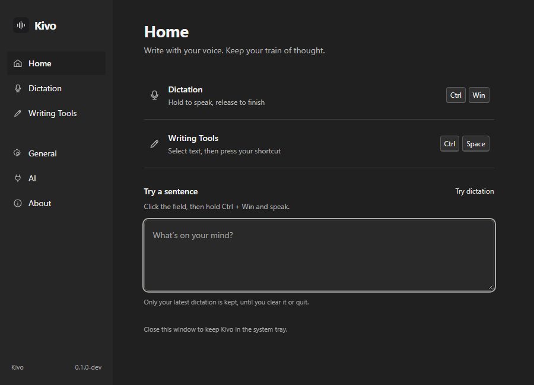
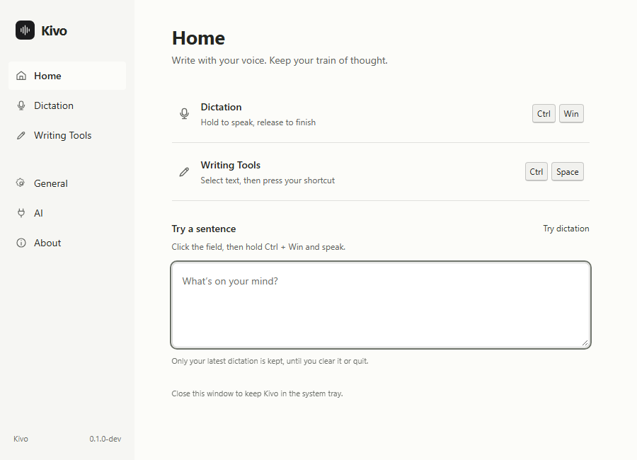
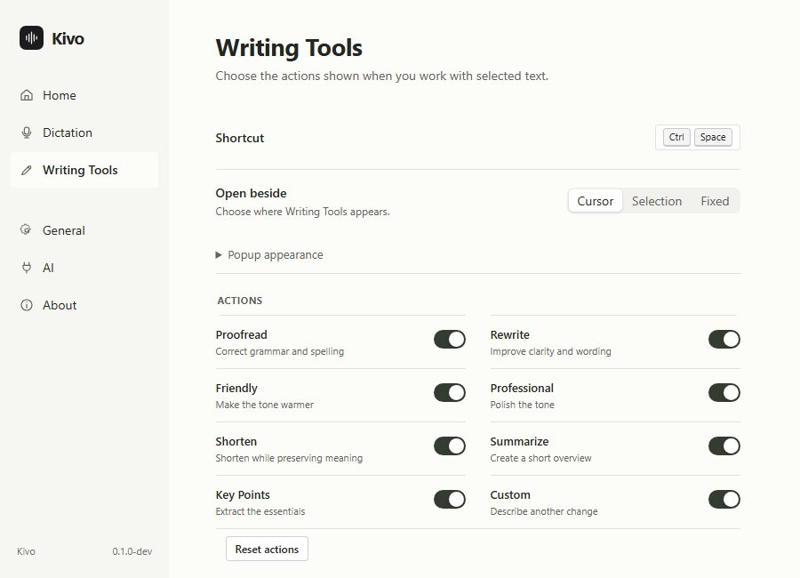

# Native inspection and polish — 13 September 2026

The earlier overhaul passed GitHub CI at `a43a3b1`, including macOS. The changes below are local and require a new CI run before release.

## Changed after inspecting the installed Windows app

- Windows still painted a purple title bar. Kivo now sets neutral native caption colours, follows light/dark appearance, and reapplies border suppression on focus and theme changes. High contrast uses system colours. Standard Windows controls remain.
- Home repeated instructions and used a large marketing headline. It now shares the settings heading scale, offers two shortcut rows that open the corresponding preferences, and gives dictation practice a clear editable field.
- Dark mode used a green tint throughout. It now uses neutral charcoal, with clearer text contrast and distinct Home, AI connection, and About icons.
- Writing Tools kept a 460px window behind a much shorter panel. Its native height now follows actual content, capped by the user's height preference. Resizing keeps the top-left position stable unless it must move to remain on-screen. Measurement excludes the entrance animation's scale.
- Writing preferences show actions in two columns at desktop sizes. Popup appearance is expandable; numeric controls have proper spacing and commit complete edits on blur/Enter. Escape cancels an edit; blank values restore the saved value. Switching sections resets scrolling.
- About links now open the repository and release notes instead of displaying unfinished placeholders.

## Evidence and limits

- Actual Windows candidate: inspected Home, General, Writing Tools settings, and the floating Quick chat window. Confirmed neutral main-window captions in System/dark and explicit light mode, restored the user's System preference, and confirmed the popup no longer has a large transparent area below it.
- A thin accent line remained on popup activation in the first candidate. Border attributes are now reapplied after focus changes. **Final native verification of this last adjustment is pending:** Computer Use disconnected after the user's continuation and failed recovery with `Computer Use native pipe is unavailable`.
- Native speech recognition quality, text insertion across external apps, multi-monitor scaling, high-contrast window composition, and installed upgrade/uninstall flows have not been verified in this pass.
- Shared frontend branches for Windows and macOS pass browser checks. The latest local changes have not yet compiled on a Mac.
- Validation: TypeScript, ESLint, 21 frontend unit tests, 45 Windows Rust tests, Rust clippy with warnings denied, packaging checks, and 18 Playwright tests pass. New browser checks cover popup expansion after shrinking, complete numeric edits, blank/Escape recovery, shortcut navigation, and scroll reset.

## Preview

These screenshots show the implemented frontend in the Windows browser harness. They are not native caption screenshots.

## Windows candidate

The per-user NSIS installer remains `src-tauri/target/release/bundle/nsis/Kivo_0.1.0_x64-setup.exe`. No release was published and the installed copy was not replaced. The installer built during this pass is unsigned and uses the repository's existing beta build tuning.

Windows frame implementation follows [Microsoft's DWM attribute documentation](https://learn.microsoft.com/en-us/windows/win32/api/dwmapi/ne-dwmapi-dwmwindowattribute), including caption, text, and border colour attributes.

Final installer: 3278614 bytes; built 2026-09-13 18:42:44; SHA-256: 55EDD44BBA4ADB23EACDEFE9EF30B3621E7E26CB2C41EFADC0EF56FC702C537C.

